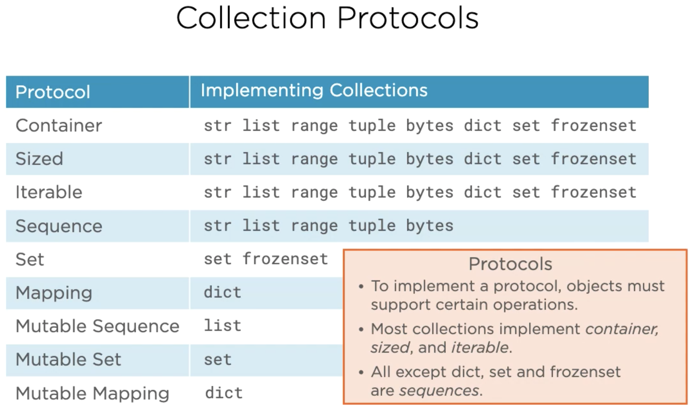

# Iterators and Collection Protocols

This repository is created in order to consolidate the study, and practices for 
the Python Iterators, and other collection protocols. 

## Iterator & Iterable Protocols

Following is, how the Iterator, and Iterable protocols are defined.

The above illustration shows, that every Iterator object is also an Iterable 
object.

* The builtin `iter` function calls the `__iter__` method of the type. 
* The builtin `next` function calls the `__next__` method of the type.

The image also demonstrates, that all Iterators also conforms to the Iterable 
protocol. This is the reason, we can use and Iterator as Iterable with for loops.

In the [basic_iterators](https://github.com/sarkarchandan/pycollections/blob/master/iter/basic_iterators.py) 
module we have demonstrated some basic implementations of the iterators. We have 
implemented some iterators, which performs basic level-order, inorder, and preorder 
tree traversal, when the tree is represented as a sequence. 

There are other kind of iterators, which behaves differently from the regular 
iterators e.g., filtering iterators, transformer iterators etc.

> While studying the filtering iterators we have introduced an imperfect binary 
> tree. We have seen for the previous iterators, that imperfect binary tree is 
> a problem. However, there are ways to work with imperfect binary trees by 
> introducing some placeholder objects. These objects, which represents something 
> else than their values, are called sentinel objects. Introducing these objects 
> enables an imperfect binary tree to be treated as a perfect binary tree. Using 
> `None` as sentinel objects are not a good idea, because if we do so, we won't 
> be able to have None as binary tree member. A better option is to create some 
> `object` instances having no value, and creating a custom iterator to skip these 
> special objects.

In the [filter_iterators](https://github.com/sarkarchandan/pycollections/blob/master/iter/filter_iterators.py) 
module, we have created `SkipMissingIterator` class, which takes an `Iterable` 
object, and filters the placeholder missing objects. We have demonstrated how 
we have reused the `InOrderIterator`, which needs the perfect binary tree in 
order to create an infix notation, and then filtered out the missing objects.

In the [transform_iterators](https://github.com/sarkarchandan/pycollections/blob/master/iter/transform_iterators.py) 
we have created `TranslationIterator` class, which takes a machine-readable 
expression as Iterable, and translates the same to humanreadable expression.

In the [iterable](https://github.com/sarkarchandan/pycollections/blob/master/iter/iterable.py) 
module, we have demonstrated a simple custom class `PerfectBinaryTree`, which 
implements the Iterable protocol. We observed, that it can be used anywhere, 
where an Iterable type is expected.

In the [alternative_iterable](https://github.com/sarkarchandan/pycollections/blob/master/iter/alternative_iterable.py) 
module we have demonstrated an alternative method to create Iterable collection 
using the `__getitem__` dunder method. Here we have created an Iterable sequence 
of rational numbers using `Fraction` objects. We have only provided the 
implementation of the `__getitem__` in order to effectively create an Iterable. 
This Iterable can be passed in to `iter` function to create an Iterator. The 
`__getitem__` method should have an integer index, and should raise IndexError 
when the index goes beyond the length of the underlying sequence. It can also 
be used in more sophisticated manner.

In the [extended_iter](https://github.com/sarkarchandan/pycollections/blob/master/iter/extended_iter.py) 
module we have explored an alternative form of the `iter` function. We have used 
this function so far in order to create an Iterator from an Iterable object. It 
has an alternative form, in which we pass in a Callable object along with a 
sentinel value. The Callable object takes zero argument, and it is invoked once 
per iteration. The Callable yields a value per iteration, and it stops, when the 
said value becomes equal to the passed in sentinel value. We can make use of 
this utility in order to create a sequence until some predefined terminating 
value is encountered. In this module we have explored several of such possibilities.

## Collection Protocols

Following are a list of the most common Collection protocols supported in Python 
standard library.

Most Collection protocols can be implemented by providing implementation of one 
or more dunder methods. First, we need to understand some specifications of the 
utilities, which these protocols support.

* `Container` protocol allows the membership testing using the `in`, and `not in` 
    operators.
* `Sized` protocol allows the checking of number of elements in the collection 
  by passing the object to the builtin `len` function.
* `Iterable` protocol, as we have seen already allows itself to be iterated 
  using `for in` construct It also allows creation of an Iterator out of itself 
  using the `iter` function.
* `Sequence` protocol supports a range of things,
  * Subscripting of values from a collection using index e.g., 
    `seq[index]`.
  * Find index of an item in the collection e.g., `index = seq.index(item)`.
  * Count number of items in the collection e.g., `num = seq.count(item)`.
  * Reverse a sequence using built in `reversed` function e.g., `r = reversed(seq)`.
* `Set` protocol allows algebraic set operations.
* `Mapping` protocol associates values with hashable keys. It is represented in 
  Python by the dict data structure.
* `Mutable Sequence, Set, and Mapping` protocols are representatives of the 
  mutable versions of the corresponding protocols.

In the [coll/collection](https://github.com/sarkarchandan/pycollections/blob/master/coll/collection.py) 
module we have implemented a `SortedFrozenSet` type, which implements `Sized`, 
`Iterable`, `Sequence`, `Container`, and `Set` protocols. We have implemented 
the SortedFrozenSet with the Test Driven Development approach.
