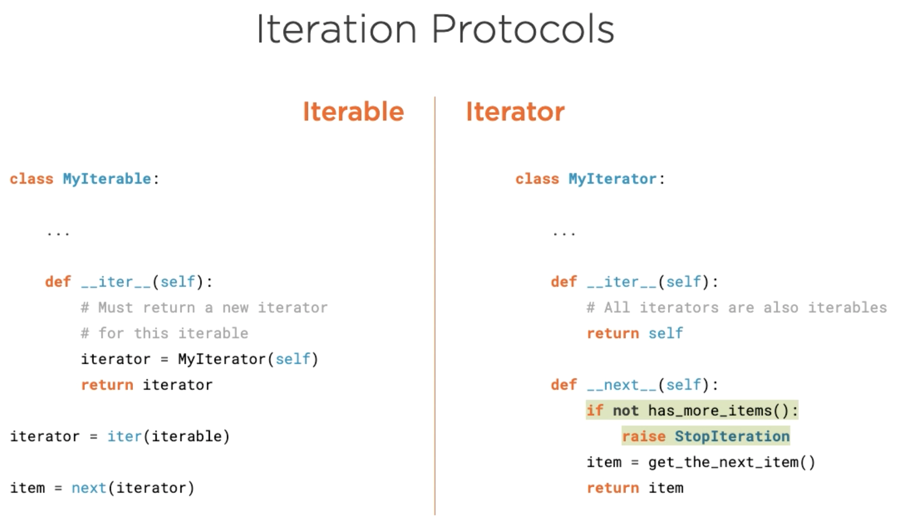

# Iterators and Collection Protocols

This repository is created in order to consolidate the study, and practices for 
the Python Iterators, and other collection protocols. Following is, how the 
Iterator, and Iterable protocols are defined.

* The builtin `iter` function calls the `__iter__` method of the type. 
* The builtin `next` function calls the `__next__` method of the type.

The image also demonstrates, that all Iterators also conforms to the Iterable protocol. 
This is the reason, we can use and Iterator as Iterable with for  loops.

In the [basic_iterators](https://github.com/sarkarchandan/pycollections/blob/master/iterators/basic_iterators.py)  
module we have demonstrated some basic implementations of the iterators. We have 
implemented some iterators, which performs basic level-order, inorder, and preorder 
tree traversal, when the tree is represented as a sequence. 

There are other kind of iterators, which behaves differently from the regular 
iterators e.g., filtering iterators, transformer iterators etc.

> While studying the filtering iterators we have introduced an imperfect binary 
> tree. We have seen for the previous iterators, that imperfect binary tree is 
> a problem. However, there are ways to work with imperfect binary trees by 
> introducing some placeholder objects. These objects, which represents something 
> else than their values, are called sentinel objects. Introducing these objects 
> enables an imperfect binary tree to be treated as a perfect binary tree. Using 
> `None` as sentinel objects are not a good idea, because if we do so, we won't 
> be able to have None as binary tree member. A better option is to create some 
> `object` instances having no value, and creating a custom iterator to skip these 
> special objects.

In the [filter_iterators](https://github.com/sarkarchandan/pycollections/blob/master/iterators/filter_iterators.py) 
module, we have created `SkipMissingIterator` class, which takes an `Iterable` 
object, and filters the placeholder missing objects. We have demonstrated how 
we have reused the `InOrderIterator`, which needs the perfect binary tree in 
order to create an infix notation, and then filtered out the missing objects.

